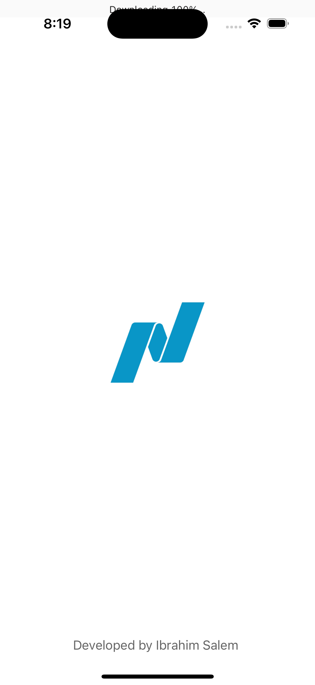
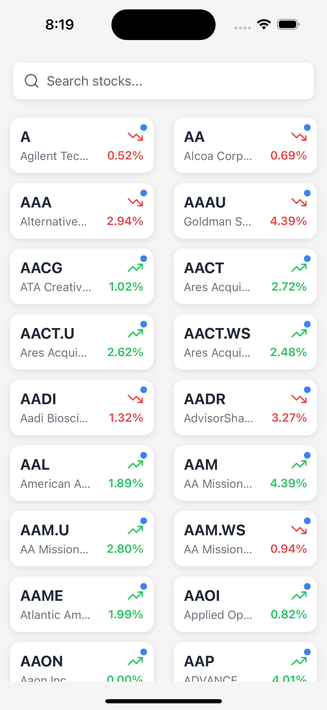
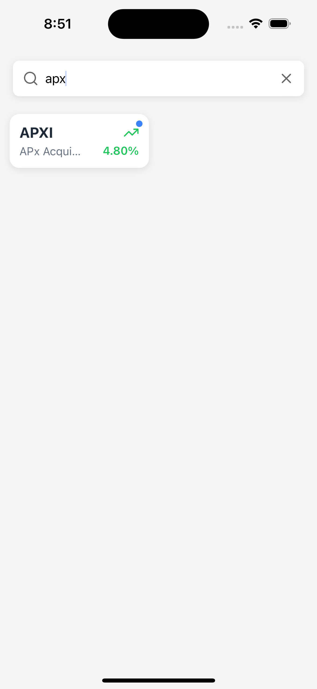

# Stock Market App

A React Native mobile application that allows users to browse and search stocks listed on the Nasdaq exchange. The app provides real-time stock information using the Polygon.io API.

## 📱 Screenshots
<div align="center">
  <div style="display: flex; flex-direction: row; flex-wrap: wrap; gap: 10px; justify-content: center;">
    <!-- Each screenshot is 250px wide for better README presentation -->
    
    
    
  </div>
</div>


## Features

- Browse stocks listed in Nasdaq exchange
- Real-time search functionality
- Infinite scrolling for loading more stocks
- Pull-to-refresh for latest data
- Responsive grid layout
- Error handling and rate limiting protection
- Performance optimized for large lists

## Prerequisites

Before you begin, ensure you have the following installed:
- [Node.js](https://nodejs.org/) (v14 or later)
- [npm](https://www.npmjs.com/) or [yarn](https://yarnpkg.com/)
- [React Native CLI](https://reactnative.dev/docs/environment-setup)
- Xcode (for iOS development)
- Android Studio (for Android development)
- [CocoaPods](https://cocoapods.org/) (for iOS dependencies)

## Installation

1. Clone the repository:
```bash
git clone <repository-url>
cd stock-market-app
```

2. Install dependencies:
```bash
npm install
# or
yarn install
```

3. Install iOS dependencies:
```bash
cd ios
pod install
cd ..
```

4. Set up environment variables:
   - create  `.env`
   - Add your Polygon.io API key to the `.env` file:
```bash
POLYGON_API_KEY=TINCaMq866MulC7fQQC48lH6s2sB02rJ
```

## Running the App

### iOS
```bash
# Start Metro bundler
yarn start
# Run iOS app
yarn run ios
```

### Android
```bash
# Start Metro bundler
yarn start
# Run Android app
yarn run android
```

## Project Structure

```
src/
├── api/
│   ├── client.ts        # API client configuration
│   └── types.ts         # TypeScript interfaces for API
├── components/
│   ├── SearchBar.tsx    # Search input component
│   └── StockCard.tsx    # Stock item display component
├── screens/
│   ├── ExploreScreen.tsx # Main screen with stock list
│   └── SplashScreen.tsx  # Initial loading screen
├── hooks/
│   └── useStocks.ts     # Custom hooks for data fetching
├── config/
│   └── index.ts         # App configuration
└── App.tsx              # Root component
```

## Dependencies

- `@tanstack/react-query`: For data fetching and caching
- `axios`: HTTP client
- `react-native-config`: Environment variables management
- `@react-navigation/native`: Navigation
- `react-native-screens`: Native navigation utilities
- `lodash`: Utility functions

## Performance Optimizations

The app includes several performance optimizations:
- Virtualized list rendering with `FlatList`
- Debounced search to minimize API calls
- Memoized components and callbacks
- Image and resource optimization
- API response caching

## Testing

Run the test suite:
```bash
npm test
```

## Building for Production

### Android
```bash
cd android
./gradlew assembleRelease
```
The APK will be available at `android/app/build/outputs/apk/release/app-release.apk`

### iOS
Build the app using Xcode:
1. Open `ios/StockMarketApp.xcworkspace`
2. Selec
